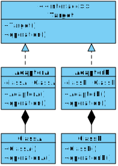

[Назад к описанию](../../README.md)

# Структурные шаблоны: "Адаптер" и "Компоновщик"

Содержание:
- [Шаблон "Адаптер"](#Шаблон-Адаптер)
- [Шаблон "Компоновщик"](#Шаблон-Компоновщик)

## Шаблон "Адаптер"

Шаблон "Адаптер" (структурный шаблон) предназначен для преобразования интерфейса одного класса в интерфейс другого. Благодаря реализации данного шаблона возможно использовать вместе классы с несовместимыми интерфейсами.

Условия применения:
- Когда необходимо использовать имеющийся класс, но его интерфейс не соответствует потребностям.
- Когда надо использовать уже существующий класс совместно с другими классами, интерфейсы которых не совместимы.

Формальная UML-диаграмма шаблона:



Формальное определение шаблона на `C++`:

```c++
// Адаптируемый класс A.
struct ClassA
{
  void operationA() {}
};

// Адаптируемый класс B.
struct ClassB
{
  void operationB() {}
};

// Интерфейс, которому адаптируются классы A и B.
struct Target
{
  virtual void operation() = 0;
};

// Адаптер класса А.
class AdapterA : public Target
{
  ClassA classA;

public:
  virtual void operation() override
  {
    classA.operationA();
  }
};

// Адаптер класса B.
class AdapterB : public Target
{
  ClassB classB;

public:
  virtual void operation() override
  {
    classB.operationB();
  }
};
```

## Шаблон "Компоновщик"

Шаблон "Компоновщик" (структурный шаблон) объединяет группы объектов в древовидную структуру по принципу "часть-целое" и позволяет одинаково работать как с отдельными объектами, так и с группой объектов.

Условия применения:
- Когда объекты должны быть реализованы в виде иерархической древовидной структуры.
- Когда клиенты единообразно должны управлять как целыми объектами, так и их составными частями. То есть целое и его части должны реализовать один и тот же интерфейс.

Формальная UML-диаграмма шаблона:


Формальное определение шаблона на `C++`:

```c++
#include <list>

using namespace std;

// Общий интерфейс для всех компонентов в древовидной структуре.
struct Component
{
  virtual void operation() = 0;
  virtual void add(Component*) {};
  virtual void remove(Component*) {};
};

// Отдельный компонент, не может содержать другие компоненты.
struct Leaf : public Component
{
  virtual void operation() override {};
};

// Компонент, который может содержать другие компоненты.
class Composite : public Component
{
  // Список вложенных компонентов.
  list<Component*> components;

public:
  virtual void operation() override {};

  virtual void add(Component* component) override
  {
    components.push_back(component);
  };

  virtual void remove(Component* component) override
  {
    components.remove(component);
  };
};

void main()
{
  Composite root;
  Leaf sub1;
  Leaf sub2;

  sub1.operation();
  sub2.operation();
  root.operation();

  root.add(&sub1);
  root.add(&sub2);
}
```