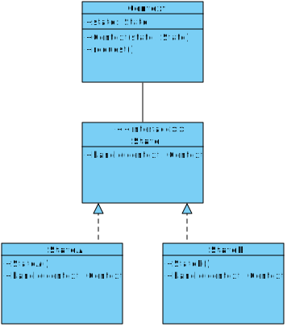

[Назад к описанию](../../README.md)

# Шаблоны проектирования. Поведенческие шаблоны: "Стратегия" и "Состояние"

Содержание:
- [Шаблоны проектирования и их применение](#Шаблоны-проектирования-и-их-применение)
- [Шаблон "Стратегия"](#Шаблон-Стратегия)
- [Шаблон "Состояние"](#Шаблон-Состояние)

## Шаблоны проектирования и их применение

Что представляют собой шаблоны проектирования? Шаблон представляет определенный способ построения программного кода для решения часто встречающихся проблем проектирования. В данном случае предполагается, что есть некоторый набор общих формализованных проблем, которые довольно часто встречаются, и шаблоны предоставляют ряд принципов для решения этих проблем.

Что же дает нам применение шаблонов? При написании программ мы можем формализовать проблему в виде классов и объектов и связей между ними. И применить один из существующих шаблонов для ее решения. В итоге нам не надо ничего придумывать. У нас уже есть готовый шаблон, и нам только надо его применить в конкретной программе.

Также мышление шаблонами упрощает групповую разработку программ. Зная применяемый шаблон проектирования и его основные принципы, другому программисту будет проще понять его реализацию и использовать ее.

В то же время не стоит применять шаблоны ради самих шаблонов. Хорошая программа предполагает использование шаблонов. Однако не всегда шаблоны упрощают и улучшают программу. Неоправданное их использование может привести к усложнению программного кода, уменьшению его качества. Шаблон должен быть оправданным и эффективным способом решения проблемы.

Существует множество различных шаблонов, которые решают разные проблемы и выполняют различные задачи. Но по своему действию их можно объединить в ряд групп. Рассмотрим некоторые группы шаблонов. В основу классификации основных габлонов положена цель или задачи, которые определенный шаблон выполняет.

1. **Порождающие шаблоны** абстрагируют процесс инстанцирования или, иными словами, процесс порождения классов и объектов.
2. **Структурные шаблоны** рассматривают, как классы и объекты образуют более крупные структуры - более сложные по характеру классы и объекты.
3. **Поведенческие шаблоны** определяют алгоритмы и взаимодействие между классами и объектами, то есть их поведение.

Как выбрать нужный шаблон? Прежде всего при решении какой-нибудь проблемы надо выделить все используемые сущности и связи между ними и абстрагировать их от конкретной ситуации. Затем надо посмотреть, вписывается ли абстрактная форма решения задачи в определенный паттерн. Например, суть решаемой задачи может состоять в создании новых объектов. В этом случае, возможно, стоит посмотреть на порождающие шаблоны. Причем лучше не сразу взять какой-то определенный шаблон - первый, который показался нужным, а посмотреть на несколько родственных шаблонов из одной группы, которые решают одну и ту же задачу.

При этом важно понимать смысл и назначение шаблона, явно представлять его абстрактную организацию и его возможные конкретные реализации. Один шаблон может иметь различные реализации, и чем чаще вы будете сталкиваться с этими реализациями, тем лучше вы будете понимать смысл шаблона. Но не стоит использовать шаблон, если вы его не понимаете, даже если он на первый взгляд поможет вам в решении задачи.

И в конечном счете надо придерживаться принципа *KISS (Keep It Simple, Stupid)* - сохранять код программы по возможности простым и ясным. Ведь смысл шаблонов не в усложнении кода программы, а наоборот в его упрощении.

## Шаблон "Стратегия"

Шаблон "стратегия" (поведенческий шаблон) определяет набор алгоритмов, инкапсулирует каждый из них и обеспечивает их взаимозаменяемость. В зависимости от ситуации мы можем легко заменить один используемый алгоритм другим. При этом замена алгоритма происходит независимо от объекта, который использует данный алгоритм.

Условия применения:
- Когда есть несколько родственных классов, которые отличаются поведением. Можно задать один основной класс, а разные варианты поведения вынести в отдельные классы и при необходимости их применять.
- Когда необходимо обеспечить выбор из нескольких вариантов алгоритмов, которые можно легко менять в зависимости от условий
- Когда необходимо менять поведение объектов на стадии выполнения программы.
- Когда класс, применяющий определенную функциональность, ничего не должен знать о ее реализации.

Формальная UML-диаграмма шаблона:


Формальное определение шаблона на `C++`:

```c++
// Общий абстрактный класс стратегии (алгоритма).
struct Strategy
{
  virtual void execute() = 0;
};

// Предоставляет свою версию execute().
struct ConcreteStrategy1 : public Strategy
{
  virtual void execute() {}
};

// Предоставляет свою версию execute().
struct ConcreteStrategy2 : public Strategy
{
  virtual void execute() {}
};

// Хранит указатель на объект стратегии (агрегация).
struct Context
{
  Strategy *contextStrategy;

  Context(Strategy *strategy)
  {
    contextStrategy = strategy;
  }

  void executeAlgirithm()
  {
    contextStrategy->execute();
  }
}
```

## Шаблон "Состояние"

Шаблон "состояние" (поведенческий шаблон) позволяет объекту изменять свое поведение в зависимости от внутреннего состояния. Применение шаблона позволяет вынести поведение, зависящее от текущего состояния объекта, в отдельные классы, и избежать перегруженности методов объекта условными конструкциями. Кроме того, при необходимости мы можем ввести в систему новые классы состояний, а имеющиеся классы состояний использовать в других объектах.

Условия применения:
- Когда поведение объекта должно зависеть от его состояния и может изменяться динамически во время выполнения.
- Когда в коде методов объекта используются многочисленные условные конструкции, выбор которых зависит от текущего состояния объекта.

Формальная UML-диаграмма шаблона:



Формальное определение шаблона на `C++`:

```c++
struct State
{
  virtual void handle(Context *context) = 0;
};

struct StateA : public State
{
  virtual void handle(Context *context)
  {
    context->state = new StateB();
  }
};

struct StateB : public State
{
  virtual void handle(Context *context)
  {
    context->state = new StateA();
  }
};

// Объект, поведение которого должно динамически
// изменяться в соответствии с состоянием.
struct Context
{
  State *state;

  Context(State *state)
  {
    this->state = state;
  }

  void request()
  {
    this->state->handle(this);
  }
};

int main()
{
  Context context(new StateA());

  context.request(); // Переход в состояние StateB
  context.request(); // Переход в состояние StateA

  return 0;
}
```