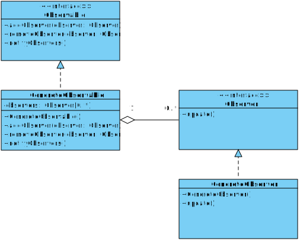

[Назад к описанию](../../README.md)

# Практическое занятие №5

## Темы занятия

- [Шаблон "Итератор"](#Шаблон-Итератор)
- [Шаблон "Наблюдатель"](#Шаблон-Наблюдатель)

## Шаблон "Итератор"

Шаблон "итератор" (поведенческий шаблон) предоставляет абстрактный интерфейс для последовательного доступа ко всем элементам составного объекта без раскрытия его внутренней структуры.

Условия применения:
- Когда необходимо осуществить обход объекта без раскрытия его внутренней структуры.
- Когда имеется набор составных объектов, и надо обеспечить единый интерфейс для их перебора.
- Когда необходимо предоставить несколько альтернативных вариантов перебора одного и того же объекта.

Формальная UML-диаграмма шаблона:


Формальное определение шаблона на `C++`:

```c++
#include <iostream>
#include <initializer_list>

using namespace std;

template <class T>
struct Container;

// Абстрактный итератор.
template <class T>
struct Iterator
{
  virtual T getCurrentItem() = 0;
  virtual T getFirstItem() = 0;
  virtual T getNextItem() = 0;
  virtual bool isDone() = 0;
};

// Конкретная реализация итератора для обхода объекта типа Container.
template <class T>
class ConcreteIterator : public Iterator<T>
{
  int current;
  Container<T> *container;

public:
  ConcreteIterator(Container<T> *container)
  {
    this->container = container;
  }

  virtual T getCurrentItem()
  {
    return container->getItem(current);
  }

  virtual T getFirstItem()
  {
    return container->getItem(0);
  }

  virtual T getNextItem()
  {
    current++;
    return isDone() ? T() : getCurrentItem();
  }

  virtual bool isDone()
  {
    return current >= container->getSize();
  }
};

// Абстрактный контейнер.
template <class T>
struct Container
{
  virtual Iterator<T> *createIterator() = 0;
  virtual T getItem(int position) = 0;
  virtual int getSize() = 0;
};

// Конкретная реализация контейнера, хранит элементы.
template <class T>
class ConcreteContainer : public Container<T>
{
  int size;
  T *items;

public:
  ConcreteContainer(initializer_list<T> list)
  {
    size = list.size();
    items = new T[size];

    int i = 0;
    for (T item : list)
    {
      items[i] = item;
      ++i;
    }
  }

  ~ConcreteContainer()
  {
    delete[] items;
  }

  virtual Iterator<T> *createIterator()
  {
    return new ConcreteIterator<T>(this);
  }

  virtual T getItem(int position)
  {
    return items[position];
  }

  virtual int getSize()
  {
    return size;
  }
};

int main()
{
  ConcreteContainer<int> container = {1, 2, 3, 4, 5};
  Iterator<int> *iterator = container.createIterator();

  int item = iterator->getFirstItem();
  while (!iterator->isDone())
  {
    cout << item << endl;
    item = iterator->getNextItem();
  }

  return 0;
}
```

## Шаблон "Наблюдатель"

Шаблон "наблюдатель" (поведенческий шаблон) представляет поведенческий шаблон проектирования, который использует отношение "один ко многим". В этом отношении есть один наблюдаемый объект и множество наблюдателей. И при изменении наблюдаемого объекта автоматически происходит оповещение всех наблюдателей.

Условия применения:
- Когда система состоит из множества классов, объекты которых должны находиться в согласованных состояниях.
- Когда общая схема взаимодействия объектов предполагает две стороны: одна рассылает сообщения и является главным, другая получает сообщения и реагирует на них. Отделение логики обеих сторон позволяет их рассматривать независимо и использовать отдельно друга от друга.
- Когда существует один объект, рассылающий сообщения, и множество подписчиков, которые получают сообщения. При этом точное число подписчиков заранее неизвестно и процессе работы программы может изменяться.

Формальная UML-диаграмма шаблона:



Формальное определение шаблона на `C++`:

```c++
#include <iostream>
#include <list>

using namespace std;

// Представляет наблюдаемый объект.
struct Observable
{
  // Добавить наблюдателя.
  virtual void addObserver(Observer *observer) = 0;
  // Удалить наблюдателя.
  virtual void removeObserver(Observer *observer) = 0;
  // Уведомить наблюдателей.
  virtual void notifyObservers() = 0;
};

// Конкретная реализация наблюдаемого объекта.
class ConcreteObservable : public Observable
{
  // Список наблюдателей.
  list<Observer *> observers;

public:
  virtual void addObserver(Observer *observer)
  {
    observers.push_back(observer);
  }

  virtual void removeObserver(Observer *observer)
  {
    observers.remove(observer);
  }

  virtual void notifyObservers()
  {
    for (Observer *observer : observers)
      observer->update();
  }
};

// Представляет наблюдателя, который подписывается
// на все уведомления наблюдаемого объекта.
struct Observer
{
  // Вызывается наблюдаемым объектом для уведомления наблюдателя.
  virtual void update() = 0;
};

// Конкретная реализация наблюдателя.
struct ConcreteObserver : public Observer
{
  virtual void update() {}
};
```