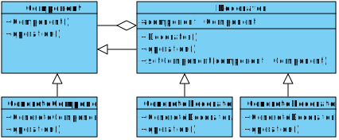

[Назад к описанию](../../README.md)

# Практическое занятие №6

## Темы занятия

- [Шаблон "Фасад"](#Шаблон-Фасад)
- [Шаблон "Декоратор"](#Шаблон-Декоратор)

## Шаблон "Фасад"

Шаблон "фасад" (структурный шаблон) представляет шаблон проектирования, который позволяет скрыть сложность системы с помощью предоставления упрощенного интерфейса для взаимодействия с ней.

Условия применения:
- Когда имеется сложная система, и необходимо упростить с ней работу. Фасад позволит определить одну точку взаимодействия между клиентом и системой.
- Когда надо уменьшить количество зависимостей между клиентом и сложной системой. Фасадные объекты позволяют отделить, изолировать компоненты системы от клиента и развивать и работать с ними независимо.
- Когда нужно определить подсистемы компонентов в сложной системе. Создание фасадов для компонентов каждой отдельной подсистемы позволит упростить взаимодействие между ними и повысить их независимость друг от друга.

Формальная UML-диаграмма шаблона:


Формальное определение шаблона на `C++`:

```c++
// Компонент системы.
struct ComponentA
{
    void operationA1() {}
    void operationA2() {}
};

// Компонент системы.
struct ComponentB
{
    void operationB1() {}
    void operationB2() {}
};

// Компонент системы.
struct ComponentC
{
    void operationC1() {}
    void operationC2() {}
};

// Фасад, предоставляет единую точку для работы с компонентами.
class Facade
{
    ComponentA *componentA;
    ComponentB *componentB;
    ComponentC *componentC;

public:
    Facade(ComponentA *componentA,
           ComponentB *componentB,
           ComponentC *componentC) : 
             componentA(componentA),
             componentB(componentB),
             componentC(componentC) {}

    void operation1()
    {
        componentA->operationA1();
        componentB->operationB1();
        componentB->operationB2();
    }

    void operation2()
    {
        componentA->operationA2();
        componentB->operationB1();
        componentC->operationC1();
        componentC->operationC2();
    }
};

void main()
{
    Facade facade(new ComponentA(), new ComponentB(), new ComponentC());
    facade.operation1();
    facade.operation2();
}
```

## Шаблон "Декоратор"

Шаблон "декоратор" (структурный шаблон) представляет структурный шаблон проектирования, который позволяет динамически подключать к объекту дополнительную функциональность.

Условия применения:
- Когда надо динамически добавлять к объекту новые функциональные возможности. При этом данные возможности могут быть сняты с объекта
- Когда применение наследования неприемлемо.

Формальная UML-диаграмма шаблона:



Формальное определение шаблона на `C++`:

```c++
// Абстрактный компонент.
struct Component
{
    virtual void operation() = 0;
};

// Реализация компонента, в которую с помощью декоратора
// добавляется новая функциональность.
struct ConcreteComponent : public Component
{
    virtual void operation() override {}
};

// Абстрактный декоратор.
class Decorator : public Component
{
protected:
    // Декорируемый объект.
    Component *component;

public:
    void setComponent(Component *component)
    {
        this->component = component;
    }

    virtual void operation() override
    {
        if(component) component->operation();
    }
};

// Реализация декоратора, предоставляет дополнительную функциональность,
// которой должен быть расширен декорируемый объект.
struct ConcreteDecoratorA : public Decorator
{
    virtual void operation() override
    {
        Decorator::operation();
    }
};

struct ConcreteDecoratorB : public Decorator
{
    virtual void operation() override
    {
        Decorator::operation();
    }
};
```